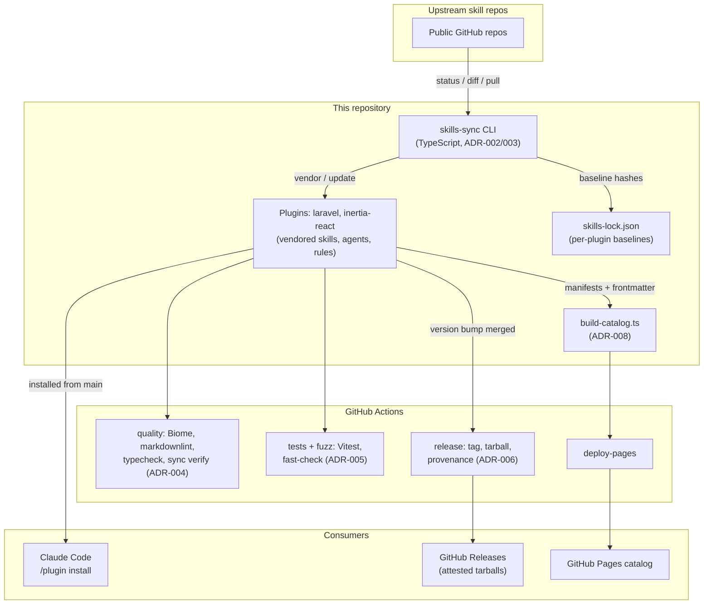

# Architecture decision records

This directory contains the Architecture Decision Records (ADRs) for the AI Toolkit.

Each ADR captures one significant decision: the situation that forced it, what we chose,
what we knowingly gave up, and (where it matters) what would make us revisit it. They
describe the repo as it is, so if the code and an ADR disagree, fix one of them.

## Index

| ADR                                                | Title                                                | Status   |
|----------------------------------------------------|------------------------------------------------------|----------|
| [001](001-plugin-marketplace-monorepo.md)          | Single-repo plugin marketplace                       | Accepted |
| [002](002-vendored-skills-with-lockfile.md)        | Vendored skills with a lockfile                      | Accepted |
| [003](003-typescript-for-repo-tooling.md)          | TypeScript with maximum strictness for repo tooling  | Accepted |
| [004](004-biome-and-markdownlint.md)               | Biome and markdownlint, with no overrides            | Accepted |
| [005](005-testing-strategy.md)                     | Testing with Vitest and fast-check property tests    | Accepted |
| [006](006-release-automation-and-provenance.md)    | Automated releases with build provenance             | Accepted |
| [007](007-supply-chain-hardening.md)               | Supply-chain hardening along OpenSSF guidelines      | Accepted |
| [008](008-project-website-on-github-pages.md)      | Project website generated from repo content          | Accepted |

## How the pieces fit together

## Adding a new ADR

Copy the shape of an existing one: Status, Context, Decision, Consequences. Number it
sequentially, add it to the table above, and write the Context section as if the reader
knows nothing about how the decision came up. The Consequences section should include the
genuine downsides; an ADR with no negative consequences usually means the author stopped
thinking too early.
