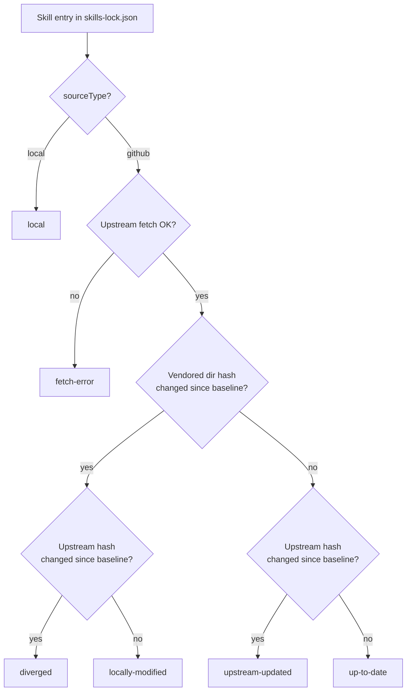

# ADR-002: Vendored skills with a lockfile

## Status

Accepted

## Context

Most skills in this marketplace are not written from scratch. They come from public
upstream repositories, and we adapt them: rewording instructions, tightening scope, adding
conventions that only make sense for our stack. That creates a two-way tension. Upstream
keeps improving, and we want to notice when it does. At the same time, our local edits are
deliberate, and a naive "update from upstream" would flatten them.

The usual mechanisms all fit badly:

- **Git submodules** pin an upstream commit but cannot carry local edits, and consumers
  installing the plugin would need the submodule resolved.
- **git subtree** can carry edits, but merge history for dozens of small skill directories
  across several unrelated upstream repos gets unpleasant fast.
- **Plain copying** loses the upstream link entirely. Six months later nobody remembers
  where a skill came from or whether it is stale.

We also wanted the check to be cheap enough to run in CI on every pull request.

## Decision

Skills are vendored as full copies, and the vendored copy is canonical. What ships to
consumers is exactly what sits in the repo, with no fetch step at install time.

Each plugin has a `skills-lock.json` that records, per skill, where it came from and two
whole-directory SHA-256 hashes taken at the last sync baseline:

```json
"laravel-dtos": {
  "source": "owner/repo",
  "sourceType": "github",
  "ref": "main",
  "skillPath": "path/inside/upstream",
  "vendoredHash": "…",
  "upstreamCommit": "…",
  "upstreamHash": "…"
}
```

Skills we wrote ourselves get `"sourceType": "local"` and only a vendored hash.

A TypeScript CLI (`npm run sync`, source in `scripts/skills-sync/`) manages the lifecycle
with six commands: `status`, `diff`, `pull`, `accept`, `seed`, and `verify`. `status`
compares current hashes against the baseline and classifies every skill:



Each state has an obvious next step. `upstream-updated` means `pull` is safe.
`locally-modified` means run `accept` to re-baseline (or `pull --force` to discard the
edits). `diverged` means a manual three-way merge, then `seed` to re-baseline both hashes.
`pull` refuses to overwrite local modifications unless forced, which is the property the
whole design exists to protect.

`status` fetches every upstream file through the GitHub API and takes a few minutes, so it
stays out of CI. `verify` is the CI gate instead: a fully offline check that every skill
directory on disk still matches its `vendoredHash`, and that lock entries and directories
correspond one-to-one. It runs in the quality workflow on every PR and again before every
release.

## Consequences

### Positive

- Local customizations survive updates by default. Losing them requires typing `--force`.
- Provenance is recorded per skill. `skills-lock.json` answers "where did this come from
  and have we touched it" without any git archaeology.
- The CI gate is offline and fast, so lockfile drift (editing a skill without
  re-baselining) is caught on the PR that introduces it.
- Consumers are unaffected by all of this. They install plain files.

### Negative

- Diverged skills need a manual three-way merge. There is no automation for reconciling an
  upstream rewrite with local edits, and with skills being prose, that is probably the
  right call anyway.
- The two-hash model has a footgun: after hand-merging upstream changes you must run
  `seed`, not `accept`. `accept` alone leaves the upstream hash stale, and a later `pull`
  would silently overwrite the merge you just did.
- Upstream awareness is pull-based. Nothing notifies us when an upstream repo changes; we
  learn about it when someone runs `status`.

### Mitigations

- The `sync-skills` skill in this repo walks the whole workflow interactively, including
  the merge-then-`seed` sequence, so the footgun is documented where it will actually be
  read.
- The maintenance guide calls out the `accept` vs `seed` distinction explicitly.
