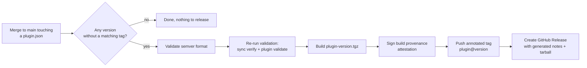

# ADR-006: Automated releases with build provenance

## Status

Accepted

## Context

Consumers install these plugins into their development environments, where skills and
agents directly shape what an AI assistant does to their code. That makes the supply-chain
question sharper than for an ordinary library: someone auditing an installed plugin should
be able to prove the artifact they have corresponds to a specific commit in this repo, and
was built by CI rather than on a maintainer's laptop.

Manual releases also do not survive contact with a multi-plugin repo. Two plugins with
independent versions means remembering which one changed, tagging with the right
namespace, building the right tarball, and writing notes scoped to the right directory.
That is exactly the kind of chore that gets skipped.

## Decision

Releases are fully automated by `.github/workflows/release.yml` and driven by version
bumps. The human's entire job is: bump `version` in the plugin's `plugin.json` in the same
commit as the change, then merge to `main`.



The workflow scans every `*/.claude-plugin/plugin.json` on pushes to `main` that touch
one, and treats any version without an existing `<plugin>@<version>` tag as pending. For
each pending release it:

1. Rejects anything that is not plain `x.y.z` semver.
2. Re-runs the lock consistency check and `claude plugin validate` so a broken state
   cannot be tagged.
3. Packs the plugin directory into `<plugin>-<version>.tgz`.
4. Signs a GitHub build provenance attestation for the tarball via
   `actions/attest-build-provenance`, tying it to the workflow, repo, and commit.
5. Pushes the annotated tag and creates a GitHub Release with notes generated from the
   commits that touched that plugin since its previous tag, tarball attached.

Anyone can verify an artifact with one command:

```sh
gh attestation verify <plugin>-<version>.tgz --repo noppu-labs/ai-toolkit
```

The releases page doubles as the per-plugin changelog. Generated notes can be polished
afterwards with `gh release edit`.

Write permissions (`contents`, `id-token`, `attestations`) are scoped to the release job
only; the workflow default is read-only. A `concurrency` group serializes release runs so
two merges cannot race on tag creation.

## Consequences

### Positive

- Releasing is one line in a diff. Since the workflow re-validates before tagging, a
  release is also a proof that the tagged state passed the gates.
- Provenance turns "trust me" into "verify it". The attestation chain is checkable by any
  consumer with the `gh` CLI, no key management on our side.
- Tag-per-plugin (`laravel@0.1.3`) keeps independent version histories legible in one
  repo, and release notes are scoped to commits touching that plugin.

### Negative

- The trigger is `plugin.json` changing. Merge a consumer-facing change without a bump and
  nothing happens, silently. This is the flip side of explicit versioning and is
  documented rather than solved.
- Generated release notes are commit subjects, which are only as good as the commit
  hygiene behind them.
- Old releases published before attestation existed had no provenance; a one-off backfill
  workflow attested tarballs for those retroactively, but their provenance is inherently
  weaker (it proves the backfill built them, not the original release).
